# Függvények - esettanulmány

Ebben a részben függvényeket írunk. Megpróbáljuk úgy tenni ezt, hogy minél több kódot újrahasználjunk, de közben ne vesszünk a használhatóságból.<br>
A teknőc-grafikát fogjuk használni, ez nem része *Julia*-nak, de a megfelelő<br> 
modul ([ThinkJulia](https://github.com/BenLauwens/ThinkJulia.jl)) már hozzá lett adva a használt virtuális-képen található *Julia*-hoz.


```julia
using ThinkJulia
teki = Turtle()
@svg begin
  forward(teki,-50)
  turn(teki,30)
  forward(teki,-50)
  end 200 200 "./elso.svg"
```


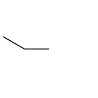


## Magyarázatok 

1. *Julia*ban a modul az eszköz arra, hogy összegyűjtsünk valamilyen közös célt megvalósító, leíró függvényeket, típusokat, konstansokat. A modulokat hozzá kell adni a rendszerhez és az ```using ModulNév``` utasítással elérhetővé kell tenni a benne definiált neveket.
1. a ```2.``` sorban a ```teki``` nevet egy ```Turtle``` típusú értékhez kötjük.
1. *Julia*ban ```@```-tal kezdődnek a makrók nevei. Elég most annyi, hogy ez a makró létrehozza a teknőc 
   mozgásának megfelelő rajzokat. A ```200 200 "./elso.svg"``` paraméterek a default értékeket írják felül.
1. a ```begin end``` párra gondoljunk zárójelként.
1. a teknőc helye jelen esetben a ```200x200``` pixeles tartomány közepe és jobbra néz.

## Feladat
Módosítsuk a fenti kódot, hogy egy négyzetet rajzoljon ki.

## Megoldás


```julia
teki = Turtle()
@svg begin
  forward(teki,50)
  turn(teki,90)
  forward(teki,50)
  turn(teki,90)
  forward(teki,50)
  turn(teki,90)
  forward(teki,50)
end 200 200 "./elso.svg"
```


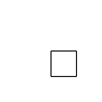


## Ciklus - ismétlés

A négyzet rajzolásánál, mint ahogy más tevékenységeknél lényegében 4-szer **ugyanazt** csináltuk.<br>
Ez **ciklus** használatával egyszerűsíthető:


```julia
teki = Turtle()
@svg begin
  for i in 1:4
    forward(teki,50)
    turn(teki,90)
  end
end 200 200 "./elso.svg"
```


## Magyarázat

1. a ```3.``` sor a ciklus feje. A ```6.```-ban levő ```end``` zárja a ciklus magját, törzsét.
1. a ```2.``` sorban azt írjuk le, hogy egy ```i``` változóval szeretnénk rendre végigmenni az ```1:4``` 
   objektum elemein,<br> és minden egyes elemre valamilyen a törzsben leírt tevékenységet végezni.
1. az ```1:4``` egy ```UnitRange``` típusu érték. Lényegében az első négy egész szám kollekciójaként gondolhatunk rá.
1. észrevehetjük, hogy a végén  van egy feleslegesnek tűnő ```turn```, ez nem baj mert igy a teknőc 
   alaphelyzetbe áll vissza a végén.


## Feladat - általánosítás

Írjunk egy függvényt, mely a teknőc típusú paraméterével rajzoltat egy $a>0$ oldalú négyzetet.

## Megoldás


```julia
function square(t, a) 
  @svg begin
    for i in 1:4
      forward(teki,a)
      turn(teki,90)
    end
  end 200 200 "./elso.svg"
end
square(Turtle(),10)
square(Turtle(),20)
```


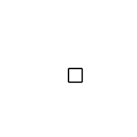


Bár **bezár**tuk a négyzetrajzoló utasításokat egy függvénybe, de sajnos ez a változat nem alkalmas <br> egyszerre több rajz készítésére. Szedjük ki a bedrótozott ```@svg``` makrót!

## Javítás


```julia
function square(t, a) 
  for i in 1:4
    forward(t,a)
    turn(t,90)
  end
end

@svg begin
  for i in 10:10:50
    square(Turtle(),i)
  end
end 200 200 "./elso.svg"

```


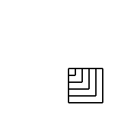


```julia
@svg begin
  t=Turtle()
  vek=10:5:70
  for i in vek
    square(t,i)
    turn(t,360/length(vek))
  end
end 200 200 "./elso.svg"

```


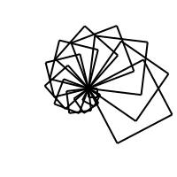


### Általánosítás 
Nem csak négyzeteket akarunk persze rajzolgatni. Hogyan lehetne egy hasonlóan egyszerű függvénnyel <br>
bármilyen szabályos $n$ szöget kirajzoltatni? <br>
Ehhez elég azt meggondolni, hogy egy konvex $n$-szögre a (belső szögek összege) + $2\pi=n\pi$.
<br>Ez a szabályos $n$-szög esetén azt jelenti, minden lépésenként $\frac{2\pi}{n}$-el fordulunk.


```julia
function regPoly(t, n, a) 
  alfa=360/n
  for i in 1:n
    forward(t,a)
    turn(t,alfa)
  end
end
@svg begin
  t=Turtle()
  penup(t)
  forward(t,-300)
  pendown(t)
  for n=3:2:14
    regPoly(t,n,20)
    penup(t)
    turn(t,-3)
    forward(t,80)
    pendown(t)
  end
  end 600 200 "./elso.svg"
```


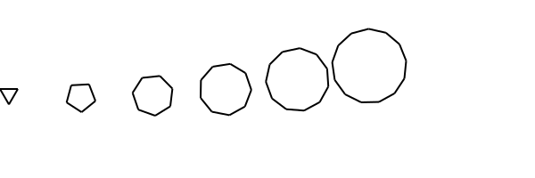


## Magyarázat
1. az elejen a rajzolási terület bal széléhez mozgatjuk a teknőcöt
1. a ```penup, pendown``` függvény ```felemeli,leteszi``` a tollat a képzeletbeli papírlapra.

Próbáljuk ki negatív oldalhosszúságra a ```regPoly```-t:


```julia
@svg begin
  t=Turtle()
  for a = 10:4:40
    regPoly(t,8,a)
    regPoly(t,8,-a)
    turn(t,20)
  end
end 200 200 "./elso.svg"
```


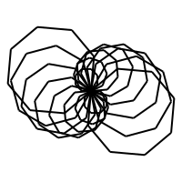


Tehát negatív $𝑎$-ra jól működik, de mindig ugyanolyan irányban (𝑓𝑜𝑘>0) kezdjük a rajzolást és mindig a
teljes sokszöget megrajzoljuk. A részleges kirajzoláshoz  szükség van egy $0<c\le 1$ számra, ami megmondja hanyadrészét akjuk kirajzolni az alakzatnak.
Ha jól meggondoljuk ez az új paraméter alkalmas a szög előjelének 
beállítására is.


```julia
function regPoly(t, n, a, c) 
  alfa=sign(c)*360/n
  c=abs(c)
  cn=floor(c*n)
  for i in 1:Int(cn)
    forward(t,a)
    turn(t,alfa)
  end
  a=a*(c*n-cn)
  if a != 0.0
    forward(t,a)
  end
end

```


    regPoly (generic function with 2 methods)


Próbáljuk ki:


```julia
@svg begin
  n=5; a=30
  for k=1:n  
    t=Turtle()  
    penup(t)
    forward(t,-200+k*55)
    pendown(t)
    regPoly(t,n,30,k/n)
  end
end 300 200 "./elso.svg"

```


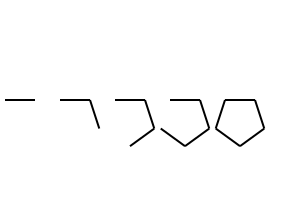


```julia
@svg begin
  n=3; a=30
  for k=1:2n  
    t=Turtle()  
    penup(t)
    forward(t,-200+k*45)
    pendown(t)
    regPoly(t,n,30,k/(2n))
  end
end 300 200 "./elso.svg"

```


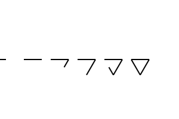


## Kör
A szabályos sokszög után természetes az igény a kör-re. A kör egy "végtelen" oldalú szabályos sokszögnek gondolható, így megpróbálhatjuk a ```regPoly```-t alkalmazni. A függvényt három paraméterrel szeretnénk hívni: ```circle(t, r, c)``` hasonlóan a ```regPoly```.

## Feladat

Írjunk olyan függvényt mely megrajzolja az aktuális pontból (nem a középpont!) induló $r>0$ sugarú kör $c$-ed részét.<br>
A rajzolt sokszög kerülete $n\cdot a$, a keresett kör kerülete $2r\pi$, ezeket egyenlővé téve, az $a$-t úgy kellene meghatározni hogy ne legyen túl sok pixel a hossza. 
Ha mondjuk $1<a<5$-et alapul vesszük, akkor $\frac{2r\pi}{5}<n<2r\pi$ adódik. Ebből tudunk $n$-re egy megfelelő értéket adni. (pl. a két határ számtani közepét vesszük)

## Megoldás


```julia
function circle(t, r, c=1) # c=1 default, nem kell kiírni híváskor ha c=1
  n=max(3,Int(floor(0.6*(2*r*pi))))
  a=2*r*pi/n
  regPoly(t, n, a, c)
end

@svg begin
  t=Turtle()
  n=7
  alfa=360/n
  for d in 1:n
    for r in 15:5:50
      circle(t,r)
    end    
    turn(t,alfa)
  end
end 200 200 "./elso.svg"
```


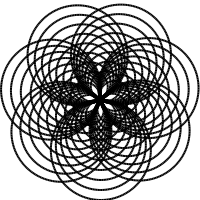


## Kiegészítő anyag

Ha a kör rajzolása közben növeljük a sugarát, például egyenletesen akkor spirált rajzolunk.<br> 
(Sokféleképpen lehet növelni, az egyenletes növelés az arkhimédeszi spirált adja). Mivel a célunk egymásra épülő függvények "rendszerének" 
építése, ezért először a ```regPoly``` spirál változatát írjuk meg. 
Nevezzük ```regPolySp```-nak. Hogyan képzelhetjük el használatát? 
Eszünkbe juthat, hogy az $a$ kezdó oldalhosszat növeljük meg valamilyen 
$A$ hosszra $n$ lépésben, ezért a terv egy ```regPolySp(t, n, a, c, A)``` módon hívható függvény írása.

## Feladat 

Írjunk egy ```regPolySp``` függvényt. 


```julia
function regPolySp(t, n, a, c, A)
  alfa=sign(c)*360/n
  c=abs(c)
  da=(A-a)/n
  cn=floor(c*n)
  for i in 1:Int(cn)
    forward(t,a)
    turn(t,alfa)
    a=a+da
  end
  forward(t,(a+da)*(c*n-cn))
end
```


    regPolySp (generic function with 1 method)


Próbáljuk ki:


```julia
@svg begin
  t=Turtle()
  penup(t); forward(t,-80);pendown(t)
  regPolySp(t,4,10,1,10)
  penup(t); forward(t,40);pendown(t)
  regPolySp(t,4,10,2,20)
  penup(t); forward(t,80);pendown(t)
  regPolySp(t,6,10,-2,30)
end 200 200 "./elso.svg"

```


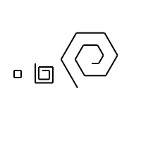


```julia
@svg begin
  t=Turtle()
  penup(t); forward(t,-80);pendown(t)
  regPolySp(t,5,10,2,20)
  regPolySp(t,5,26,-2,16)
    
#  penup(t); forward(t,40);pendown(t)
 # regPolySp(t,4,10,2,20)
  #penup(t); forward(t,80);pendown(t)
  #regPolySp(t,6,10,-2,30)
end 200 200 "./elso.svg"

```


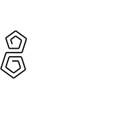


Láthatjuk, hogy a paraméterek megfelelő választásával a sima ```regPoly``` működését is tudja az új függvény. Ennek segítségével 
már megírható a ```circleSp``` függvény mely spirált rajzol.


```julia

```


```julia
function circleSp(t, r, c, R) 
  n=max(3,Int(floor(0.6*(r+R)*pi)))
  regPolySp(t, n, 2*r*pi/n, c, 2*R*pi/n)
end

@svg begin
  t=Turtle()
  circleSp(t,5,5,10)
end 200 200 "./elso.svg"
```


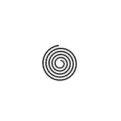

